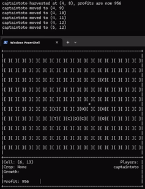

# Farm With Friends
A small multiplayer farming game I made to learn MySQL and practice Python.



# Requirements

The server will require a MySQL database called "Farm" on the machine it's being run on. All of the SQL is contained in db.py. If you don't want to deal with a database, then you can change the Database class to just be a dummy object. To initialize the database, server_lib/init.sql is provided to set up the needed tables.

To connect to the database you'll need to install `mysql-connector-python`:

```
> pip install mysql-connector           <- try first
> pip install mysql-connector-python    <- then this if the other didn't work
```

If players are on different networks, the server computer will need to be set up to accept connections from other devices. You can test to see if the server is setup properly by having a client `ping` it.

```
> ping hostname
```

The client will require the `curses` library. For Windows, install with:

```
> pip install windows-curses
```

Mac and Linux should already come with the library working.

# Running

Start the server with:

```
> python server.py
```

And enter the database password. The game will start, loading in the saved state. To close the server, just kill the process with ^C.

Players can join the game by setting the server's IP address in lib/consts.py, then running:

```
> python client.py
```

If the player doesn't have a username set in lib/consts.py, they will be prompted to enter one. Their username will be used to login to the server.

# Player Controls

`WASD` - movement

`E` - plant / harvest

`Q` - quit
